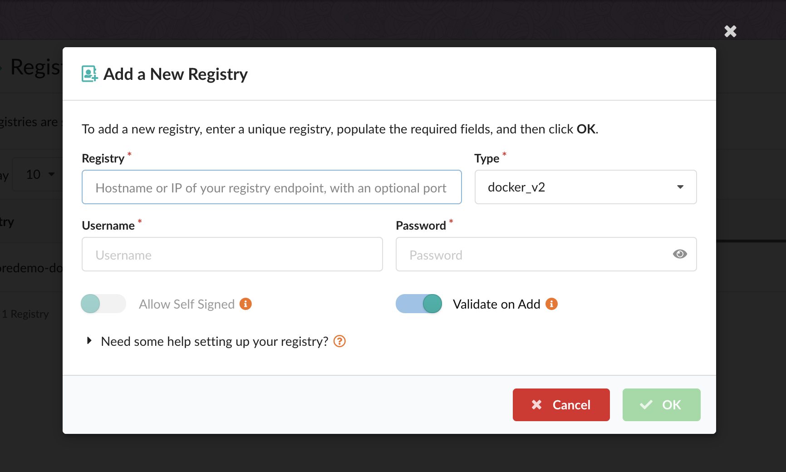
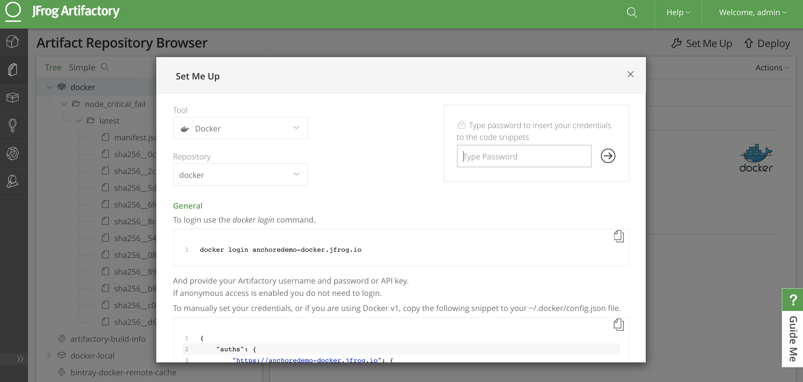
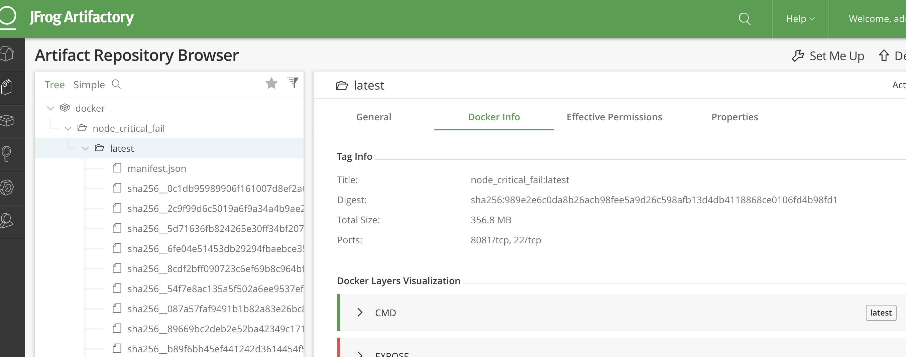
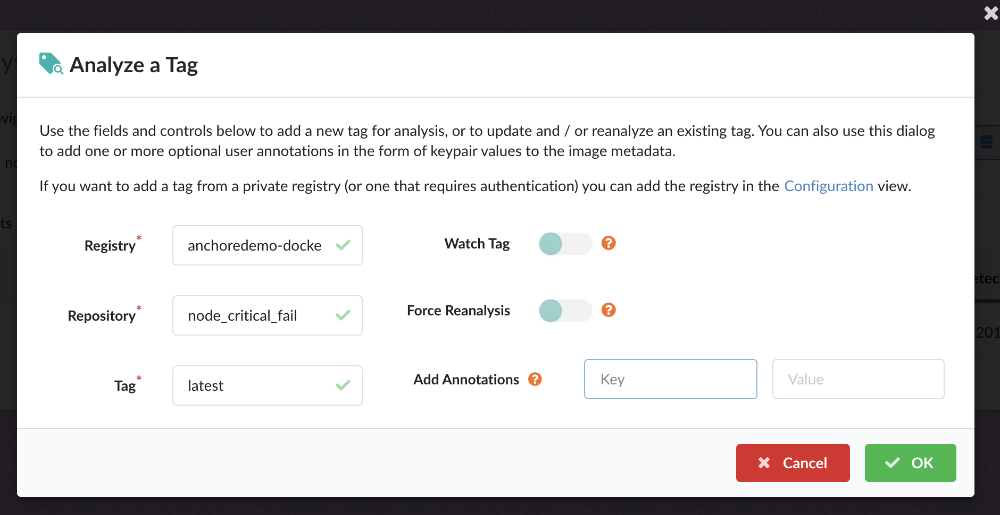

# Using Anchore with JFrog Artifactory

This document will walk through integrating Anchore with JFrog Artifactory. 

## Prerequisites

- Access to an installed Anchore Engine or Enterprise instance
- JFrog Artifactory installed
- Docker registry configured in Artifactory

### Configuring Anchore access to the Artifactory Docker Registry

#### Anchore Enterprise UI

Navigate to the configure tab within the UI, select registries, and click 'Add New Registry'

Fill in the following fields to add the private registry to Anchore: 

**Note:** To find the hostname of your Artifactory registry, you can select set me up in the UI and you will see the following popup:

**Note:** The username and password fields should be the same credentials you pass via a `docker login`

In this example, we can see the hostname for this registry is *anchoredemo-docker.jfrog.io*

### Scanning an image

**Note:** To find the image repository and tag of a particular image in Artifactory, select the image and tag you would like analyzed and select 'Docker Info' in the Artifactory UI.

In this example we can see that the repository and tag combination for this image is: node_critical_fail:latest

To scan an image from our configured registry, navigate to the image analysis tab and click 'Analyze Tag'

Fill in the following fields to analyze the tag with Anchore:

The fields inputs for the image we'll be scanning with Anchore are: 

- registry: anchoredemo-docker.jfrog.io
- repository: node_critical_fail
- tag: latest
